### AWS Lambda Version Control & Alias Management

## 🚀 Why Use Lambda Versioning & Aliases?
In real-world production systems, deploying changes directly to a Lambda function can cause:
- Accidental outages
- Difficult rollbacks
- No separation between testing and production
- Uncontrolled changes affecting users

AWS Lambda **versioning and aliases** solve these problems by introducing **immutability, safety, and control** into serverless deployments.

### Key Benefits
- **Immutable releases**: Each version is a fixed snapshot of code + configuration
- **Zero-downtime deployments**: Switch traffic instantly using aliases
- **Safe testing**: Test new versions without impacting production
- **Instant rollback**: Repoint an alias to a previous version
- **Enterprise-ready workflow**: Used in CI/CD, canary, and blue/green deployments

This approach is **mandatory for production-grade Lambda applications**.

## 🧠 Core Concepts

### Lambda Function
A Lambda function consists of:
- Application code
- Runtime (Node.js, Python, Java, etc.)
- Configuration (memory, timeout, environment variables)

### Lambda Versions
- A **version** is an immutable snapshot of the Lambda function
- Versions are numbered (`1`, `2`, `3`, ...)
- Once published, a version **cannot be modified**
- `$LATEST` is mutable and should **never** be used for production traffic

### Lambda Aliases
- An **alias** is a logical pointer to a specific Lambda version
- Aliases represent environments such as:
  - `Prod`
  - `Test`
  - `Stage`
- Aliases can be updated instantly without redeploying code

 

---

### 🚀 Step-by-Step Guide:

## Step 1: Create the Lambda Function

1. Sign in to **AWS Management Console**

 
    

        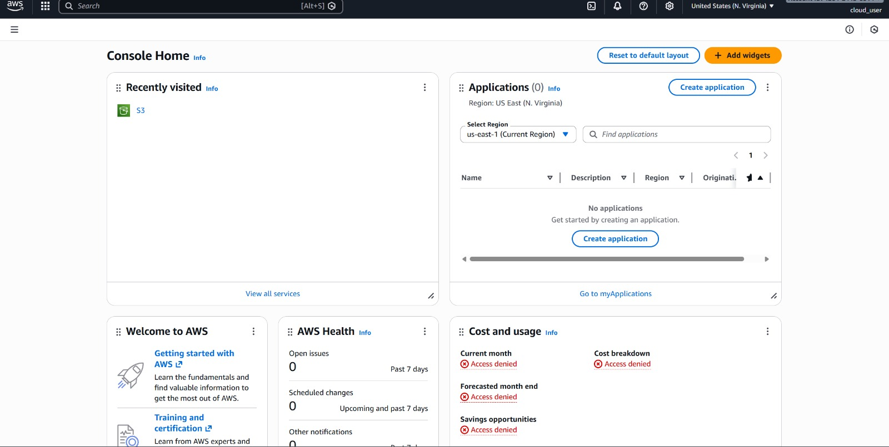
    

 

2. Navigate to **AWS Lambda**

 
    

        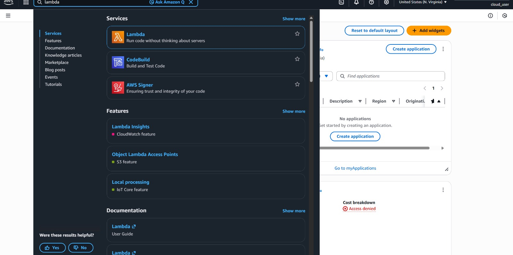
    

 

3. Click **Create function**

 
    

        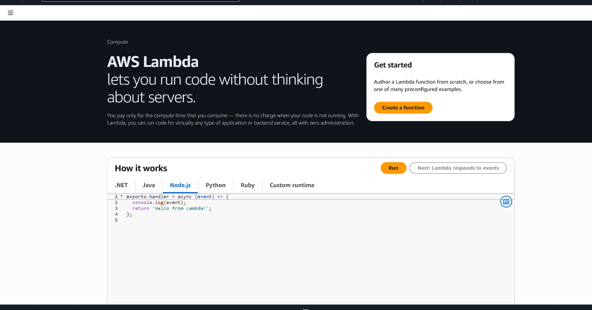
    

 

4. Select **Author from scratch**
5. Provide:
   - **Function name**: `my-lambda-function`
   - **Runtime**: (Node.js / Python / Java)
   - **Execution role**: Create or choose an IAM role
6. Click **Create function**

 
    

        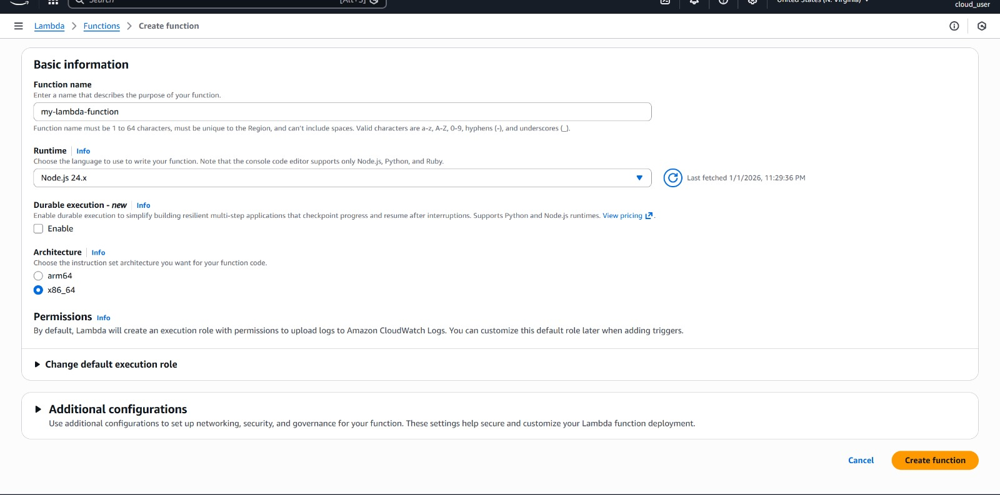
    

 

## Step 2: Upload Initial Code (Version 1)

1. Open your Lambda function
2. Go to the **Code** tab
3. Click **Upload from**
4. Select **.zip file**
5. Upload `Version1.zip`
6. Click **Save**
 
    

        
    

 

⚠️ Code is uploaded to `$LATEST` at this stage

 
    

        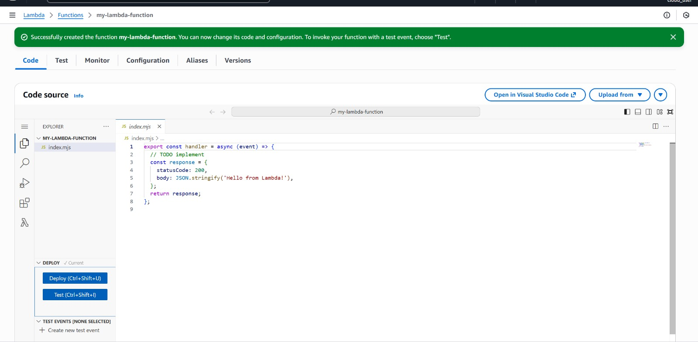
    

 

## Step 3: Publish Version 1

1. Open the **Versions** tab
2. Click **Publish new version**
3. Enter description (optional)
4. Click **Publish**
 
    

          
        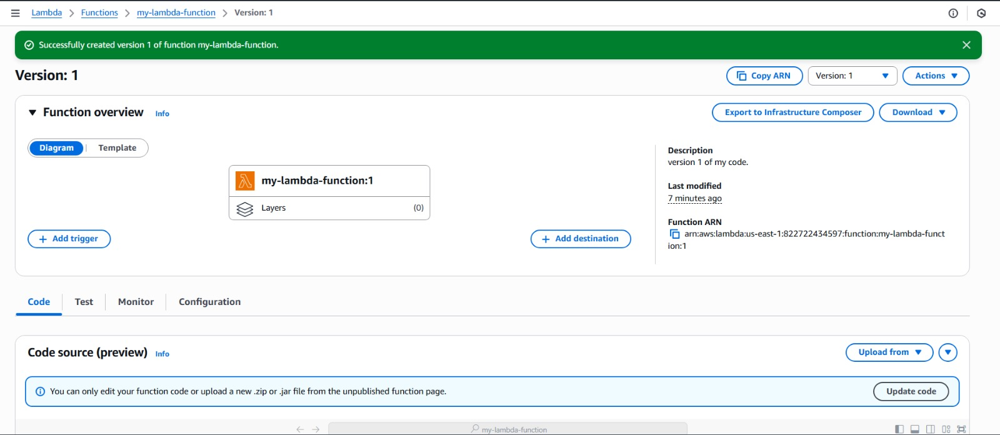
    

 

✅ Version **1** is now immutable

## Step 4: Create `Prod` Alias

1. Click on **Actions** drop down
2. Click **Create alias**
3. Enter:
- **Alias name**: `Prod`
- **Version**: `1`
- **Description** (optional)
4. Click **Save**
 
    

        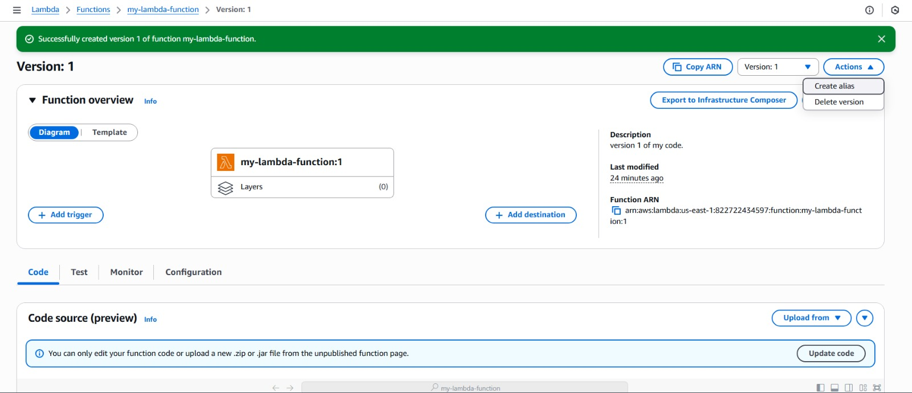  
        
    

 

✅ Production traffic now points to **Version 1**
 
    

        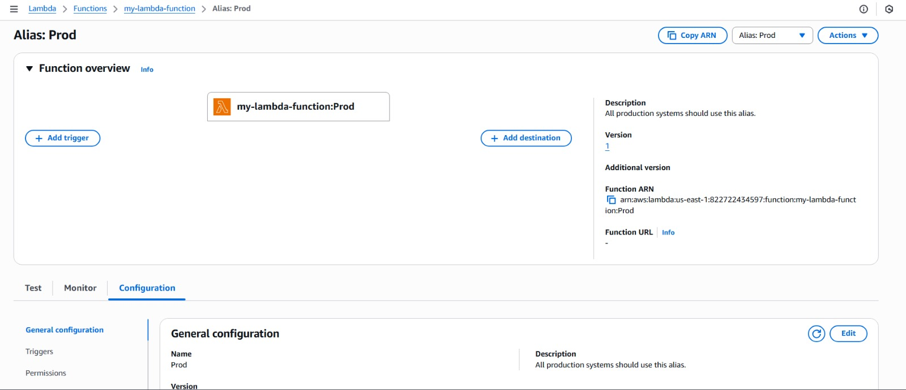
    

## Step 5: Upload Updated Code (Version 2)

1. Return to the **Code** tab
2. Upload `Version2.zip`
3. Click **Save**

 
    

        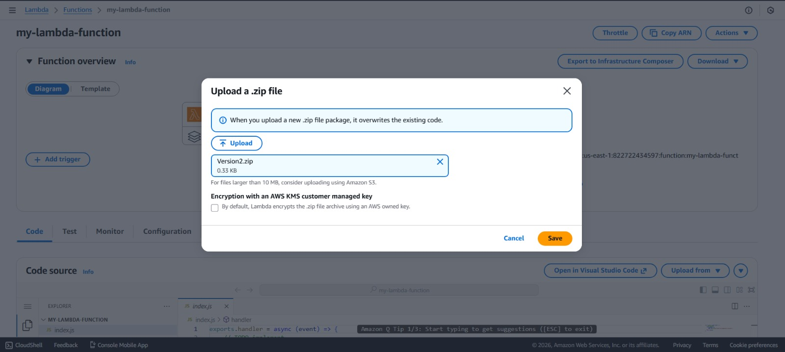
    

 

⚠️ Only `$LATEST` is updated — production remains safe

## Step 6: Publish Version 2

1. Click on **Actions**
2. Click **Publish new version**

 
    

        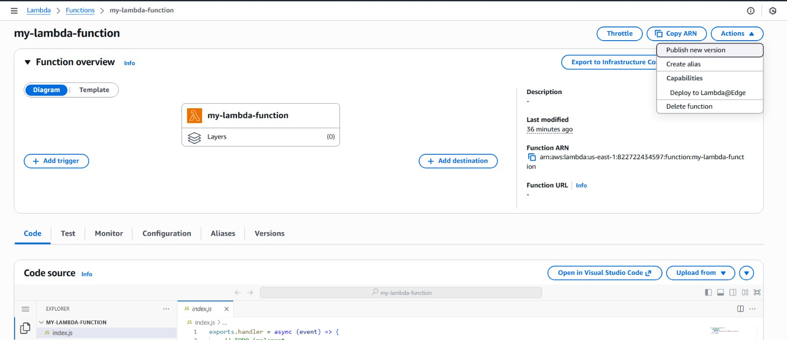
    

 

3. Enter description (optional)
4. Click **Publish**

 
    

        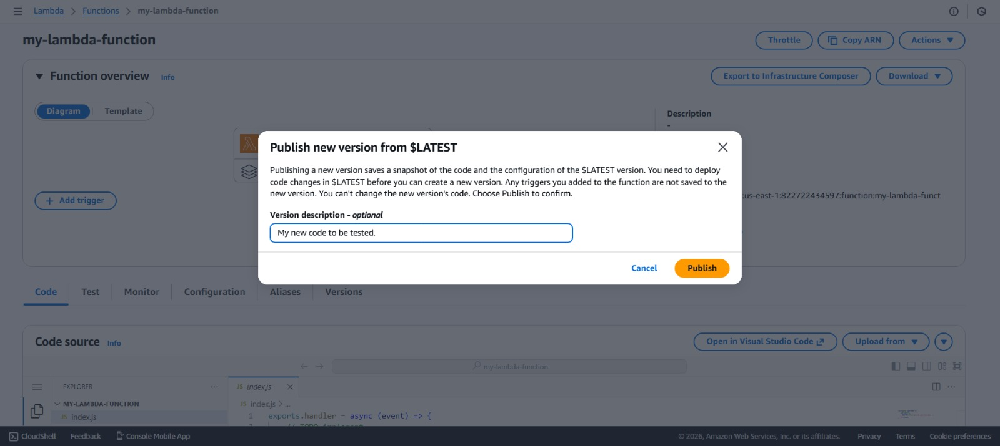
    

 

✅ Version **2** is created

 
    

        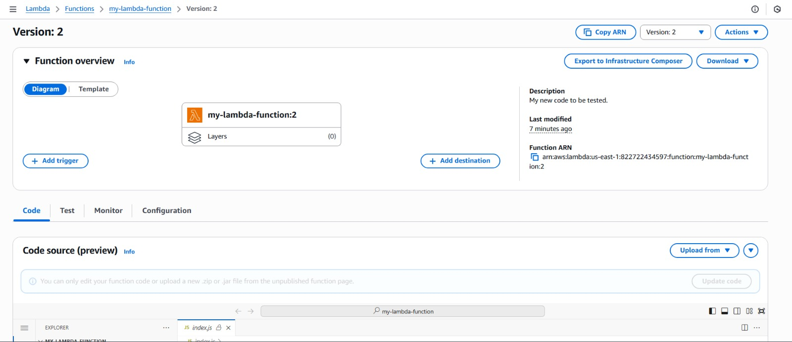
    

## Step 7: Create `Test` Alias

1. Click on **Actions** 
2. Click **Create alias**
3. Enter:
- **Alias name**: `Test`
- **Version**: `2`
- **Description** (optional)
4. Click **Save**
 
    

        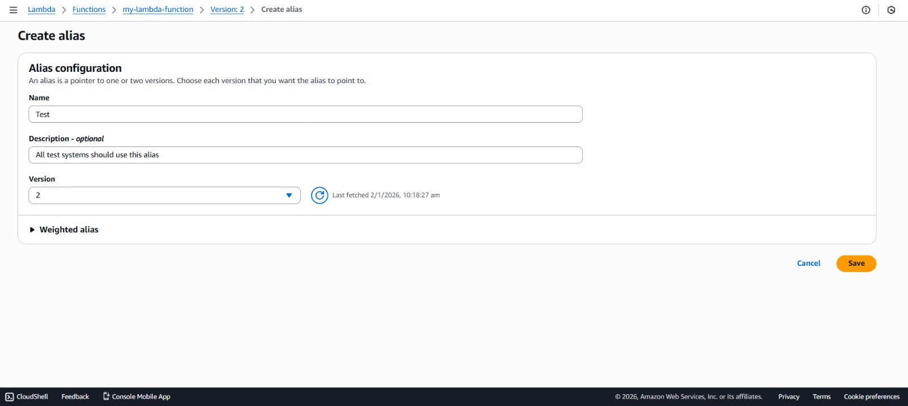  
        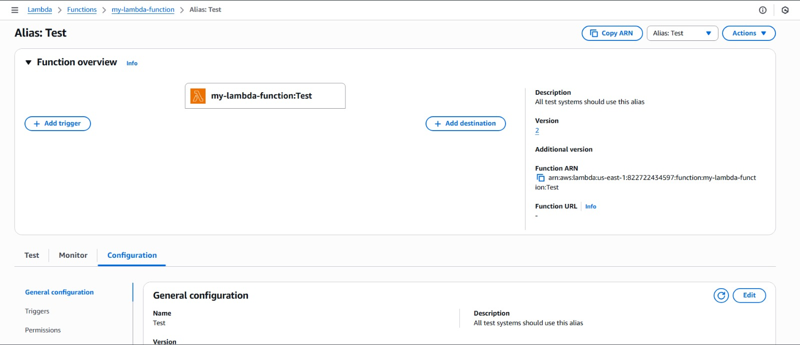
    

 

✅ Test traffic now points to **Version 2**
 
    

        
    

## 🔁 Promote Test to Production

Once testing is successful:

1. Open **Aliases**
2. Click **Prod**
3. Click **Edit**
 
    

        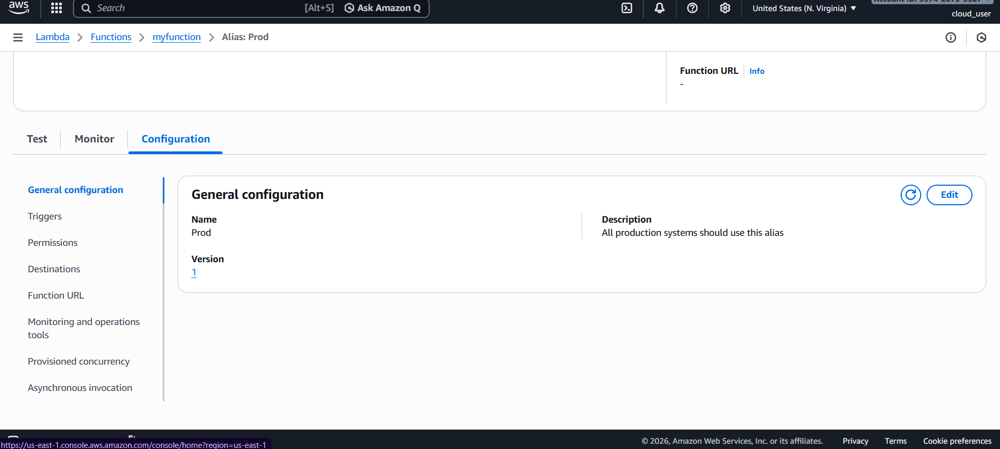
    

 

4. Change **Version** from `1` → `2`
5. Click **Save**
 
    

        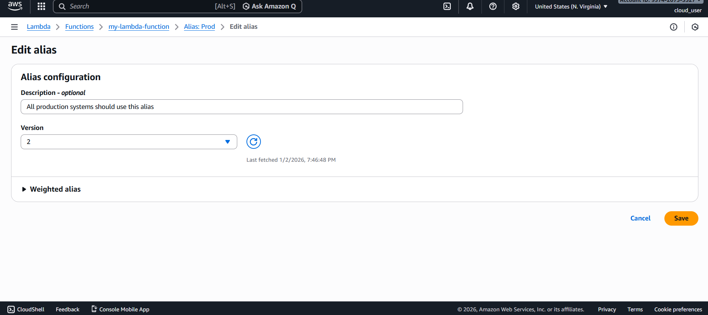
    

 

🚀 Production now runs Version 2 with **zero downtime**

 
    

        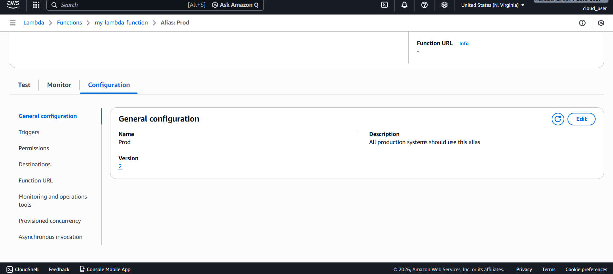
    

---

## ⏪ Rollback Strategy

If any issue occurs in production:

1. Open **Aliases**
2. Edit **Prod**
3. Change version back to `1`
4. Save

⏱️ Rollback completes instantly
 
 
    

        
    

 

## 🔐 Security & IAM Guidelines
- Grant permissions to **aliases**, not versions
- Use least-privilege IAM roles
- Control alias updates via IAM policies
- Enable CloudWatch logging for traceability

## 📌 Final Takeaway
Lambda **versioning + aliases** provide:
- Controlled deployments
- Environment isolation
- Instant rollback
- Production-level reliability

This workflow is the **gold standard** for managing AWS Lambda deployments using the AWS Console.

